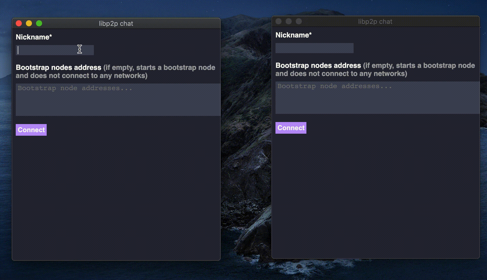

# libp2p Chat

Peer-to-peer chat app built using libp2p as a learning project.



## Table of Contents

- [Installing](#installing)
- [Connecting to the Test Network](#connecting-to-the-test-network)

## Installing

Available platforms:

| Platform | Installers |
|----------|------------|
| Linux    | [.rpm](https://github.com/FelipeRosa/go-libp2p-chat/releases/download/v0.2.0/libp2p-chat-0.2.0-1.x86_64.rpm), [.deb](https://github.com/FelipeRosa/go-libp2p-chat/releases/download/v0.2.0/libp2p-chat_0.2.0_amd64.deb)|
| macOS    | [.dmg](https://github.com/FelipeRosa/go-libp2p-chat/releases/download/v0.2.0/libp2p-chat_0.2.0.dmg)|

For more options check out the [latest release page](https://github.com/FelipeRosa/go-libp2p-chat/releases/latest).

## Connecting to the Test Network

Connect to this project's bootstrap node at (can take a bit to connect):

```
/ip4/35.231.130.111/tcp/3000/p2p/12D3KooWFowUwjqqpPNrX7XYx6XH9vTu31eZFC59QLBQynpqE1u4
```

## License

This project is licensed under the [MIT License]

[MIT License]: https://github.com/FelipeRosa/go-libp2p-chat/blob/main/LICENSE
